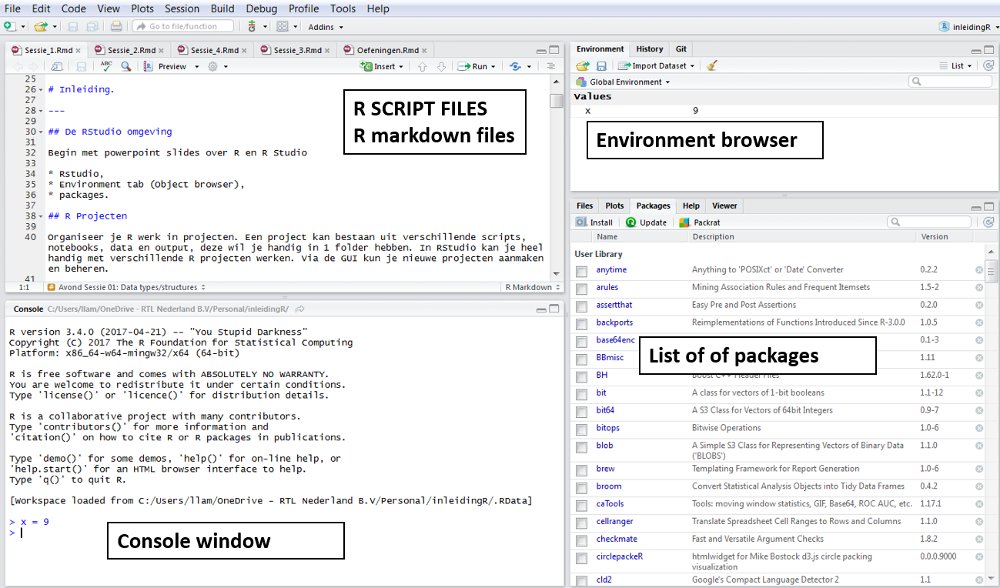

---

<br>


# Inleiding.

---

## De RStudio omgeving

Begin met powerpoint slides over R gevolgd door intro in RStudio:

* Console,
* Script windows,
* Environment tab (Object browser),
* Packages.



## R Projecten

Organiseer je R werk in projecten. Een project kan bestaan uit verschillende scripts, notebooks, data en output, deze wil je handig in 1 folder hebben. In RStudio kan je heel handig met verschillende R projecten werken. Via de GUI kun je nieuwe projecten aanmaken en beheren: File > New Project...


## Scripts 

Scripts, zijn gewone tekst files (*.R) met R code. In RStudio kan je meerdere scripts openen en bewerken. Scripts die bij elkaar horen kan je in een R Project zetten. Via het File menu > New File > R Script kan je in RStudio een nieuw R script file maken. Of gebruik de short cut: Ctrl+Shift+N.

In een script type je R code en als je met de cursor op een regel staat kan je die regel code runnen door Ctrl+Enter in te drukken. Je kan ook meerdere regels selecteren en deze regels runnen door Crtl+Enter. Zie voor meer opties het Code menu en 'Run Region'.


## R Notebooks

R notebooks bevatten meer dan alleen R code, het is een 'compleet' document met R code, output en een beschrijvende verhaallijn. In een R project kun je ook meerdere van deze notebooks en scripts beheren. Notebooks maak je met Rmarkdown, een soort light weight markup language waarin je bijvoorbeeld headers, figuren en vet gedrukt kan specificeren. Deze R cursus werkt met R notebooks. Een notebook bevat **R code chunks** die je kan runnen.

Als je op de 'Preview' knop drukt boven het R notebook krijg je een apart window te zien met het **resultaat van het R notebook**. Er wordt dan ook door RStudio een aparte file gemaakt die de naam <file_naam>.nb.html heeft. Dit is een html file die je kan delen met anderen.
 
Naast de nb.html, kan je een R notebook ook "knit" ('breien') tot een html, pdf of Word document. De header van het markdown document vertelt hoe het een en ander gebreid moet worden. Zie bijvoorbeeld dit document. Naast de 'Preview' knop zie je een pijltje waaruit je kan kiezen.


## De R Console

De R Console is een plek waar je snel even een kort stukje code wilt runnen. Type daar een R expressie in en Enter om te runnen. Output van scripts verschijnt ook in de R Console.


## Een paar simpele expressie

Hieronder een paar simpele expressies in R om te beginnen

```{r, eval=FALSE}
1 + 1
print("hello world")

## assignment kan je = of <- gebruiken,
## pijltje stamt nog uit een tijd waar het een toets op het toetsenbord was

## Als je onderstaande regel runt wordt het object test gemaakt, je ziet nog verder niks
test = 9

## Om te zien wat er in het object test zit moet je het printen
## Dit doe je door het volgende code te runnen, nu zie je iets verschijnen
print(test)

## Omdat je best vaak snel wilt zien wat er in een object zit volstaat alleen de naam ook
## dus run de volgende regel
test

## als een object al bestaat wordt die zonder waarschuwingen overschreven
test <- 3
test
```

In R zijn namen van objecten **case-sensitive!**, en we zien dat hekje `#` gebruikt wordt om commentaar in code te plaatsen. Alles na een hekje wordt niet niet gerund.

```{r, eval=FALSE}
x = 8
X = 8

ls()

786 / (87 +87)

pi / asin(1)

exp(1) 
```


Help in R is <F1> op een functie.  F1 op de functie: cut

<br>

## Git

GIT is een version control systeem wat veel gebruikt wordt onder programmeurs, je kan in RStudio makkelijk met git werken. Je moet het wel eerst installeren. Zie voor [windows](https://git-scm.com/download/win).

# Twee handige data structuren in R

In R zijn er diverse data structuren, vectoren, matrices etc... Een tweetal die we hier behandelen zijn data frames (en daar afgeleide van tibble) en lists.

## data frames

Een data frame kan je zien als een matrix, maar in tegenstelling tot een matrix, kunnen kolommen van een data frame van een andere type zijn. Voor data analyse met 'echte' data zal een data.frame de meest handige structuur zijn. je hebt bijvoorbeeld een factor kolom 'Geslacht', een double kolom met bijvoorbeeld 'geweicht' en je kan een character kolom hebben met 'achternaam'.


```{r, eval=FALSE}
x1 = 1:100
x2 = rnorm(100)
x3 = rnorm(100)
x4 = sample(c("M","F"), size = 100, replace = TRUE)

df1 = data.frame(
  kolomnaampj1 = x1,
  income = x2,
  age = x3,
  type = x4
)

# laat eerste 10 rijen zien
head(df1,10)
```

De volgende functies kan je gebruiken om wat extra info van een data frame te laten zien.

```{r, eval=FALSE}
# laat de namen van de kolommen zien
names(df1)

# names kan je ook gebruiken om bestaande kolomnamen te wijzigen
df2 = df1
names(df2) = c("A", "B", "C", "D")

# dimensie en classe
dim(df1)
class(df1)

# De levels van kolom 'type' uit mydf
levels(mydf$type)

### pas op met characters die worden standaard in data.frame naar factors omgezet
x4
class(x4)
class(df1$type)

mydf = data.frame(kolomnaampj1 = x1, income = x2, age=x3, type = x4, stringsAsFactors = FALSE)
mydf
class(mydf$type)

## Dit is ook in de Environment viewer te zien
```

Je kan net als bij matrices subscripts gebruiken in data frame om bepaalde data uit een data.frame te halen

```{r, eval=FALSE}
df1[1,3]
df1[11:20,]

df1[, 2:3]
df1$income

## kolom toevoegen
df1$NEW = df1$income / 100
df1
```


## tibbles

In R zijn tibbles een soort moderne versie van data.frames, afkomstig van Hadley Wickham en er zijn een aantal voordelen om tibbles te gebruiken. Ze hebben een iets betere print methode en transformeren nooit character naar factor.

Zie ook zijn boek en de website [tibbles.](http://tibble.tidyverse.org/)

```{r, eval=FALSE}
library(tibble)

x1 = 1:100
x2 = rnorm(100)
x3 = rnorm(100)
x4 = sample(c("M","F"), size = 100, replace = TRUE)

tb1 = tibble(
  kolomnaampj1 = x1,
  income = x2,
  age = x3,
  type = x4
)

## output in notebooks is niet verschillend maar in de console zie je dat wel
df1
tb1

## extraheren van column is consistent
df1[,1:2]
df1[,1]

tb1[,1:2]
tb1[,1]
```

Om een eerste indruk te krijgen van wat er in een data.frame zit kan je `summary` of `skimr` gebruiken

```{r, eval = FALSE}
summary(mtcars)
summary(iris)
```

Het package `skimr` moet je eerst installeren.

```{r, eval = FALSE}
devtools::install_github("hadley/colformat")
devtools::install_github("ropenscilabs/skimr")

library(skimr)
skimr::skim(mtcars)
skim(iris)
```


## lists

In R zijn lijsten de meest generieke data structuur, het kan beschouwd worden als een verzameling van andere data structuren. Een lijst kan een lijst bevatten, en lijsten zijn soms het resultaat van een functie die allerlei dingen terug geeft in een lijst.

```{r, eval=FALSE}
m2 = matrix(rnorm(100), ncol=10)
mydf = mtcars

## stop een paar objecten in een lijst
l1 <- list( a = 1, b = 1:100, c = m2, d = mydf)

## een lijst kan weer een lijst bevatten
l2 <- list (zz = rnorm(100), pp = l1)
```

Lijsten bestaan uit verschillende componenten, hoe benader je die componenten of hoe krijg je dingen uit een lijst? Dit kan met subscripts of met de naam.

```{r, eval=FALSE}
## subscripts
l2[[1]]
l2[1]

l2[[2]][[4]][[3]][5:9]

## of bij naam
l1$age[5:9]

l1[[3]]

l1$c[1,4]
l1[[4]]$x2[3]
```

Je kan aan een lijst altijd nog extra componenten toevoegen.

```{r, eval=FALSE}
l1$PP = 1

# overzicht van componenten in een lijst
names(l1)

# component 6 kan ook gewijzigd worden.
l1[[6]] = 8

## dit vult de lijst aan met componenten 7, 8 die NULL zijn
l1[[9]] = 100
l1
```


#  functions in R

We zullen hier heel kort functies in R behandelen. Een functie is ook een object zoals we diverse objecten al in R hebben. We kunnen zelf ook een functie schrijven.

```{r, eval=FALSE}
x = 1:10 
y = 1:10

# dit is geen functie....
f1 <- x + y
```

Gebruik `function` om zelf een functie te schrijven. Twee simpele voorbeelden:

```{r, eval=FALSE}
f1 = function(x, y){
  t1 = 2*y
  t2 = 3*x
  t1 + t2
}

## De laatste regel wordt geretourneerd
f1(8,6)
```


Als je de functie eerder wilt verlaten met een waarde, gebruik dan `return` in de functie.

```{r, eval=FALSE}
f2 = function(x){
  if (x < 0){
    return(1)
  }
  else
  {
    return(0)
  }
}

f2
f2(-9)

## a simple loop to calculate a sum

f3 = function(x)
{
  n = length(x)

  out = 0  
  for(i in 1:n)
  {
    out = out + x[i] 
  }
  return(out)
}

f3( 1:1000)

# natuurlijk doen we gewoon
sum(1:1000)
```


###   The %>%  pipe (or chain) operator

The chain operator gebruik je om het resultaat van een functie aan een andere functie mee te geven. De code hieronder geeft een heel simpel voorbeeldje

```{r, eval=FALSE}
tan(cos(sin(0.33)))

0.33 %>% sin %>% cos %>% tan

0.33 %>% 
  sin %>%
  cos %>% 
  tan
```

Meestal wordt dit gebruikt om code leesbaarder te maken en we komen hier in avond sessie 2 verder op terug.

<br>


# Importeren / exporteren van data 

---

Als je met R werkt heb je natuurlijk data nodig, zoals we op bovenstaande manier data hebben gemaakt zal het in de praktijk niet gebeuren met echte data sets. Die leven in data bases of in files

## Inlezen files

Er zijn een aantal packages die handig zijn om files in te lezen.

* `readr` package, voor tekst files
* `haven` package voor files van SAS, SPSS, Stata
* `readxl` voor Excel files

R heeft ook standaard functies voor het inzegen van text files, maar ik gebruik vaak de functies uit het package `readr`. Voor grote files is het veel sneller. En je ziet dan ook een progress bar. In RStudio, kan je de import functies ook aanroepen via de ** Import Dataset ** GUI die het inlezen van data begeleidt.


```{r, eval=FALSE}
### data met restaurants in Nederland
library(readr)
Restaurants = read_csv("data/Restaurants.csv")

### Excel files inlezen
library(readxl)
test = read_excel(
  "data/test.xlsx",
  range = "D8:F14"
)
```


## R Datasets

Je kan R objecten (niet alleen data frames) weg schrijven met de `saveRDS` functie, en deze kunnen weer ingelezen worden met de `readRDS` functie. files die je krijgt zijn binaire bestanden, ze kleiner dan tekst files en zijn sneller om weer in R in te lezen.

```{r, eval=FALSE}
x = rnorm(100)
saveRDS(x, "data/x.RDs")

rm(x)
x = readRDS("data/x.RDs")

GasPedaal = readRDS("data/AllCarsGasPedaal.Rds")
```


# Nog iets over geheugen gebruik

R verwerkt alles in het RAM geheugen van de computer. Het is handig om te weten hoe veel geheugen R verbruikt en hoe groot objecten zijn. Het package `pryr` bevat een aantal handig functies.

```{r, eval=FALSE}
library(pryr)

### hoeveelgeheugen kost een object met 1 miljoen getallen
x = rnorm(1e6)
object_size(x)

### hoeveel geheugen hebben we in totaal verbruikt
mem_used()

### verandering van geheugen
mem_change(
  y <- rnorm(1e7)
)
mem_used()


### verwijder een object
rm(y)
mem_used()

```

Via de 'Environment' tab kan je ook per object makkelijk zien hoe groot het is. Verander van 'List' view naar 'Grid' view.


